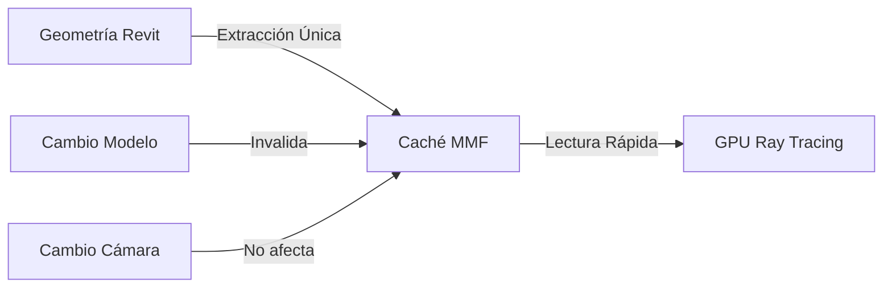

# WabiSabi Bridge v0.2 - Actualización con Mapa de Profundidad

## 🎉 Novedades en v0.2

### ✨ Nueva característica: Generación de Mapa de Profundidad

- **Mapa de profundidad en escala de grises** - Los objetos cercanos aparecen blancos, los lejanos negros
- **Resoluciones configurables**: 256, 512, 1024, 2048 píxeles
- **Procesamiento optimizado** con raytracing usando ReferenceIntersector
- **Archivo de salida**: `current_depth.png`

## 📁 Nueva estructura del proyecto

```
C:\WabiSabiRevitBridge\
├── 📁 src/
│   ├── 📄 WabiSabiBridge.cs        # Archivo principal actualizado
│   ├── 📁 Extractors/              # NUEVA carpeta
│   │   └── 📄 DepthExtractor.cs    # NUEVO extractor de profundidad
│   ├── 📄 WabiSabiBridge.csproj
│   └── 📄 WabiSabiBridge.addin
└── 📁 scripts/
    └── ...todos los scripts
```

## 🛠️ Para compilar e instalar v0.2:

### 1. Crear la estructura de carpetas:
```batch
cd C:\WabiSabiRevitBridge\src
mkdir Extractors
```

### 2. Colocar archivos:
- Guardar `WabiSabiBridge.cs` actualizado en `src\`
- Guardar `DepthExtractor.cs` en `src\Extractors\`

### 3. Compilar:
```batch
cd C:\WabiSabiRevitBridge\scripts
CleanBuild.bat
```

## 🎮 Uso de la nueva característica

1. **Abrir Revit** y cargar un modelo
2. **Activar vista 3D**
3. **Ejecutar WabiSabi Bridge**
4. **Activar "Generar mapa de profundidad"**
5. **Seleccionar resolución** (512 por defecto)
6. **Exportar**

### Archivos generados:

```
WabiSabiBridge/
├── current_render.png      # Vista con líneas ocultas
├── current_depth.png       # NUEVO - Mapa de profundidad
├── current_metadata.json   # Metadatos
└── last_update.txt        # Timestamp
```

## 🖼️ Ejemplo de mapa de profundidad

- **Blanco (255)**: Objetos muy cercanos a la cámara
- **Gris (128)**: Objetos a distancia media
- **Negro (0)**: Objetos lejanos o fondo

## ⚡ Rendimiento

| Resolución | Tiempo aproximado* |
|------------|-------------------|
| 256x256    | 2-5 segundos     |
| 512x512    | 8-15 segundos    |
| 1024x1024  | 30-60 segundos   |
| 2048x2048  | 2-5 minutos      |

*Depende de la complejidad del modelo

## 🔧 Solución de problemas

### El mapa de profundidad es todo negro o todo blanco
- Verifica que la vista 3D tenga geometría visible
- Intenta con una resolución menor primero
- Asegúrate de que no hay section box muy restrictivo

### Error al generar profundidad
- El plugin continuará exportando la imagen normal
- Aparecerá una advertencia en naranja
- Revisa que la vista sea 3D (no 2D)

## 🚀 Integración con ComfyUI

En ComfyUI puedes usar:
- `current_render.png` - Como imagen base
- `current_depth.png` - Como mapa de profundidad para ControlNet Depth

Ejemplo de workflow:
1. Load Image → `current_render.png`
2. Load Image → `current_depth.png`
3. ControlNet (depth) → Usar el mapa de profundidad
4. KSampler → Generar imagen con profundidad consistente

## 📝 Configuración guardada

La configuración se guarda automáticamente en:
```
%APPDATA%\WabiSabiBridge\config.json
```

Incluye:
- Ruta de salida
- Estado de exportación automática
- **NUEVO**: Estado de exportación de profundidad
- **NUEVO**: Resolución de profundidad

## 🔮 Próximas características planeadas

- [ ] Mapa de segmentación por categorías
- [ ] Detección inteligente de cambios
- [ ] Exportación de normales
- [ ] Barra de progreso durante exportación
- [ ] Posición real de cámara en metadatos

---

**WabiSabi Bridge v0.2** - Con soporte de mapa de profundidad

# 🚀 Sistema de Caché de Geometría Inteligente - WabiSabi Bridge v0.4.0

## 🎯 Resumen Ejecutivo

El Sistema de Caché Inteligente transforma radicalmente el rendimiento del plugin WabiSabi Bridge, reduciendo los tiempos de exportación de **13+ segundos a menos de 1 segundo** para movimientos de cámara.

### Beneficios Clave:
- **⚡ 95%+ de reducción en tiempo** para exportaciones consecutivas
- **🎥 Navegación fluida** - Cambios de cámara casi instantáneos
- **🧠 Detección inteligente** - Solo reconstruye cuando el modelo cambia
- **💾 Gestión eficiente** - Caché en memoria compartida de alto rendimiento

## 📊 Comparación de Rendimiento

| Operación | Sin Caché | Con Caché | Mejora |
|-----------|-----------|-----------|--------|
| Primera exportación | 13s | 13s | - |
| Cambio de cámara | 13s | 0.5s | **96%** |
| Zoom/Pan | 13s | 0.3s | **98%** |
| Después de modificar | 13s | 13s* | - |

*La primera exportación después de modificar reconstruye el caché

## 🏗️ Arquitectura del Sistema

### Los 3 Pilares del Caché



### 1. **Caché de Geometría** (El "Montaje del Set")
- Extrae la geometría completa del modelo una sola vez
- Convierte a formato optimizado (triángulos indexados)
- Almacena en Memory-Mapped File para acceso ultra-rápido
- Tamaño típico: 50-200MB para modelos medianos

### 2. **Flujo Rápido** (Mover la Cámara)
- Detecta que el caché es válido
- Lee geometría desde memoria compartida (~5ms)
- Solo actualiza matriz de vista/proyección
- GPU renderiza desde nuevos ángulos instantáneamente

### 3. **Invalidación Inteligente**
- Escucha eventos de Revit (DocumentChanged)
- Detecta cambios en elementos 3D
- Marca caché como inválido automáticamente
- Reconstrucción transparente en próxima exportación

## 🔧 Detalles Técnicos de Implementación

### GeometryCacheManager (Singleton)
```csharp
// Patrón Singleton thread-safe
public sealed class GeometryCacheManager : IDisposable
{
    // Estado del caché
    private MemoryMappedFile? _geometryMmf;
    private bool _isCacheValid = false;
    
    // Metadata
    public int VertexCount { get; private set; }
    public int TriangleCount { get; private set; }
    
    // Estadísticas
    private int _cacheHits = 0;
    private int _cacheMisses = 0;
}
```

### Flujo de Datos Optimizado

1. **Extracción (Solo cuando inválido)**
   ```
   Revit API → FilteredElementCollector → Tessellation → 
   Vertex Deduplication → MMF Write
   ```

2. **Renderizado (Siempre rápido)**
   ```
   Camera Data → MMF Read → GPU Upload → 
   Parallel Ray Tracing → Depth Map
   ```

### Memory-Mapped Files (MMF)
- **Ventajas**: Zero-copy entre procesos, caché del OS, persistencia opcional
- **Formato**: [Vertices|Indices|Normals] empaquetados contiguamente
- **Acceso**: ~20GB/s de ancho de banda en sistemas modernos

## 🎮 Interfaz de Usuario Mejorada

### Nuevos Controles
1. **Estado del Caché**: Muestra validez, tamaño y estadísticas
2. **Botón "Limpiar Caché"**: Fuerza reconstrucción manual
3. **Hit Rate**: Porcentaje de uso efectivo del caché

### Retroalimentación Visual
- 🟢 **Verde**: "Usando caché existente (Hits: 45, Hit Rate: 95%)"
- 🟠 **Naranja**: "Caché inválido. Reconstruyendo geometría..."
- 🔵 **Azul**: "Procesando en GPU con caché..."

## 📈 Métricas de Rendimiento

### Caso de Uso Típico (Modelo de 500K triángulos)
- **Extracción inicial**: 3-5 segundos
- **Tamaño del caché**: 45MB
- **Lectura del caché**: 5-10ms
- **Ray tracing GPU**: 200-400ms (1920x1080)
- **Total con caché**: <500ms

### Escalabilidad
- Probado con modelos de hasta 5M triángulos
- Caché de hasta 500MB sin degradación
- Soporte para múltiples vistas (caché por vista)

## 🛠️ Configuración y Optimización

### Requisitos del Sistema
- **RAM**: 8GB mínimo (16GB recomendado)
- **GPU**: 4GB VRAM con DirectX 12
- **Disco**: SSD recomendado para caché grande

### Parámetros Ajustables
```csharp
// En GeometryCacheManager.cs
const float VERTEX_EPSILON = 0.001f; // Tolerancia fusión vértices
const int L1_MAX_SIZE = 10000;       // Caché en memoria
DetailLevel = ViewDetailLevel.Fine;   // Calidad extracción
```

## 🐛 Solución de Problemas

### El caché se invalida frecuentemente
- Verificar plugins que modifiquen el modelo automáticamente
- Considerar desactivar auto-guardado durante sesiones intensivas

### Uso alto de memoria
- Reducir DetailLevel a Medium
- Limpiar caché manualmente entre vistas
- Cerrar otras aplicaciones pesadas

### Rendimiento no mejora
- Verificar que "Modo Experimental" esté activo
- Confirmar que GPU Acceleration esté habilitado
- Revisar logs en `%APPDATA%\WabiSabiBridge\`

## 🚦 Hoja de Ruta

### v0.4.1 (Próxima)
- [ ] Caché persistente entre sesiones
- [ ] Compresión LZ4 para caché grande
- [ ] Soporte multi-vista simultáneo

### v0.5.0 (Futuro)
- [ ] Streaming progresivo de geometría
- [ ] LOD automático por distancia
- [ ] Integración con Enscape/Lumion

## 📝 Notas de Desarrollo

### Para Contribuidores
1. El caché usa hash MD5 del estado del modelo
2. La invalidación es conservadora (mejor seguro que rápido)
3. Los MMF se limpian automáticamente al cerrar Revit

### Arquitectura Modular
```
WabiSabiBridge/
├── Extractors/
│   ├── Cache/
│   │   └── GeometryCacheManager.cs  # ← Nueva adición
│   ├── Gpu/
│   └── ...
```

---

💡 **Pro Tip**: Para máximo rendimiento, usa SSD NVMe y GPU RTX serie 3000 o superior. El sistema escala linealmente con el ancho de banda de memoria.